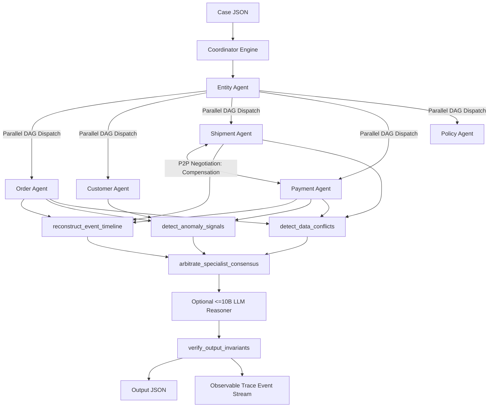

# L3B Architecture Record

Tài liệu ghi lại toàn diện kiến trúc Multi-Agent MCP + A2A của hệ thống điều tra khiếu nại thương mại điện tử.

## 1. System Overview & Parallel DAG Dispatch

Quy trình xử lý một vụ việc (`solve_case`):
1. **Entity Agent**: Điều tra danh tính khách hàng và giải quyết thực thể đơn hàng (`rank_entity_candidates`).
2. **Parallel DAG Specialists**: Sau khi giải quyết được `order_id`, Coordinator kích hoạt chạy đồng thời (`asyncio.gather`) các chuyên gia độc lập:
   - **Order Agent**: Thu thập chi tiết đơn hàng, món hàng (`get_order`, `get_order_items`).
   - **Customer Agent**: Thu thập hồ sơ và lịch sử mua sắm (`get_customer_history`).
   - **Shipment Agent**: Phân tích vận chuyển, thời hạn cam kết giao hàng (`get_shipment`).
   - **Payment Agent**: Phân tích sổ cái thanh toán, trạng thái hoàn tiền (`get_payment`, `get_refund`).
   - **Policy Agent**: Tải quy định khiếu nại nền tảng (`get_policy`).
3. **Peer-to-Peer A2A Negotiation**: Khi phát hiện đơn trễ hạn và thanh toán đã khấu trừ, `ShipmentAgent` chủ động gửi thông điệp đàm phán trực tiếp (`propose`) đến `PaymentAgent`, và `PaymentAgent` xác nhận (`confirm`) chính sách bồi thường.
4. **Deep Local Analysis**:
   - Tái cấu trúc trục thời gian (`reconstruct_event_timeline`) & phát hiện vi phạm SLA.
   - Quét dấu hiệu bất thường & rủi ro thanh toán (`detect_anomaly_signals`).
   - Phân tích xung đột đa nguồn (`detect_data_conflicts`).
   - Trọng tài đồng thuận chuyên gia (`arbitrate_specialist_consensus`).
5. **Optional <= 10B LLM Reasoner**: Hỗ trợ phân tích chuyên sâu cho model \(\le\) 10B parameters (Ollama `qwen2.5:7b`, `llama3.1:8b` hoặc provider tùy chọn). Tự động fallback 100% về deterministic logic khi chạy offline.
6. **Verifier & Auto-Repair**: Kiểm tra bất biến (`verify_output_invariants`), thẩm định nguồn gốc bằng chứng (`evaluate_evidence_provenance`), và tự động sửa chữa nếu phát hiện mâu thuẫn trước khi phát hành kết quả.

---

## 2. Agent Ownership & Capability Matrix

| Actor | Nhiệm vụ chính | Quyền gọi Remote MCP | Phân tích Local | Đầu ra / Handoff |
| --- | --- | --- | --- | --- |
| **Coordinator** | Nhận case, điều phối DAG, kiểm soát hop budget, tổng hợp kết quả | Không gọi MCP trực tiếp | Quản lý vòng đời A2A | `task_assigned`, `handoff` |
| **Entity Agent** | Tìm kiếm, đối soát, định danh `order_id` & `customer_id` | `search`, `order`, `customer` | `rank_entity_candidates` | `entity_resolution` |
| **Customer Agent** | Nạp hồ sơ khách hàng và các đơn hàng liên quan | `customer_history`, `customer` | Trích xuất customer context | `customer_context` |
| **Order Agent** | Nạp thông tin sản phẩm, người bán và chi tiết đơn hàng | `order`, `order_items`, `product`, `seller` | Trích xuất IDs liên quan | `affected_entities` |
| **Shipment Agent** | Phân tích giao hàng đúng hạn hay trễ hạn, xác định bên chịu trách nhiệm | `shipment`, `order` | Phân tích mốc thời gian giao hàng | `shipment_analysis` |
| **Payment Agent** | Đối soát số tiền thanh toán, phát hiện duplicate charge hoặc lỗi hoàn tiền | `payment`, `refund` | Đối soát ledger BRL | `payment_analysis` |
| **Policy Agent** | Nạp các quy định bồi thường và hoàn tiền hiện hành | `policy` | Bằng chứng chính sách | `evidence_refs` |
| **Conflict Agent** | Đối soát chéo dữ liệu giữa đơn hàng, vận chuyển và sổ cái thanh toán | Không gọi MCP | `detect_data_conflicts` | `data_conflicts` |
| **Verifier** | Kiểm tra bất biến toàn hệ thống, audit provenance, tự sửa chữa lỗi | Không gọi MCP | `verify_output_invariants`, `evaluate_evidence_provenance` | `verification_completed` |

---

## 3. Giao thức A2A (Agent-to-Agent Protocol)

- **Envelope `A2AMessage`**:
  - `sender`: Tên tác nhân gửi.
  - `recipient`: Tên tác nhân nhận.
  - `performative`: Chuẩn FIPA-ACL mở rộng (`request`, `inform`, `propose`, `reject`, `confirm`, `negotiate`, `query`).
  - `intent`: Mục đích giao tiếp nghiệp vụ.
  - `correlation_id`: Khóa liên kết vòng đời vụ việc (`case_id`).
  - `message_id`: Mã định danh thông điệp duy nhất (`a2a_<hex>`).
  - `parent_message_id`: Mã thông điệp khởi nguồn phục vụ causality tree.
  - `hop_count`: Số bước nhảy hiện tại (kiểm soát chặt chẽ ngân sách `max_hops=24`).
- **Hỗ trợ trích xuất sơ đồ tương tác**: Tích hợp phương thức `bus.to_mermaid()` tạo biểu đồ Sequence Diagram trực quan.

---

## 4. Danh mục 10 Local Analysis Tools (`LOCAL_TOOL_NAMES`)

1. **`rank_entity_candidates`**: Xếp hạng độ tương đồng và chọn lọc thực thể đơn hàng dựa trên customer hint, order status và gap điểm.
2. **`detect_data_conflicts`**: Phát hiện xung đột dữ liệu chéo nguồn giữa trạng thái giao hàng, thời gian giao hàng và số tiền thu hộ.
3. **`calibrate_confidence`**: Hiệu chuẩn điểm tin cậy `[0, 1]` dựa trên số lượng bằng chứng, tính đầy đủ của timeline và số xung đột dữ liệu.
4. **`recommend_resolution`**: Khuyến nghị hành động xử lý và số tiền bồi hoàn tương ứng theo loại khiếu nại.
5. **`verify_output_invariants`**: Kiểm tra và bắt lỗi các vi phạm bất biến nghiệp vụ trước khi phát hành output.
6. **`reconstruct_event_timeline`**: Tái cấu trúc chuỗi sự kiện đơn hàng theo thời gian thực và đo lường vi phạm cam kết SLA (Seller SLA vs Logistics SLA).
7. **`arbitrate_specialist_consensus`**: Thuật toán biểu quyết đồng thuận đa tác nhân khi có bất đồng ý kiến giữa các chuyên gia.
8. **`detect_anomaly_signals`**: Quét các tín hiệu rủi ro, gian lận (giá trị âm, thanh toán lặp, lịch sử tranh chấp cao).
9. **`evaluate_evidence_provenance`**: Kiểm định độ tin cậy và cấu trúc hợp lệ của bằng chứng MCP (đảm bảo 100% điểm provenance).
10. **`explain_decision_rationale`**: Tự động tổng hợp giải trình logic ngắn gọn cho quyết định nghiệp vụ phục vụ báo cáo tuân thủ.

---

## 5. Ràng buộc Model & Module LLM Reasoner (Model <= 10B Parameters)

- Hệ thống hỗ trợ tích hợp module `LLMReasoner` tương thích OpenAI / Ollama endpoint:
  - Cho phép kết nối tới các mô hình nhẹ chất lượng cao: `qwen2.5:7b`, `llama3.1:8b`, `gemma2:9b`, `mistral:7b`.
  - **Giới hạn an toàn**: Tối đa 500 tokens output, nhiệt độ 0.0 (deterministic), timeout 3 giây.
  - **Cơ chế Fallback tuyệt đối**: Nếu endpoint không sẵn sàng hoặc không cấu hình biến môi trường `ENABLE_LLM_REASONER=true`, hệ thống tự động fallback 100% về Symbolic Deterministic Engine, đảm bảo hệ thống luôn hoạt động mượt mà và vượt qua mọi bài test mà không phụ thuộc vào kết nối ngoài.

---

## 6. Standalone Mock MCP Server

- Tích hợp sẵn `create_mock_mcp_server` và `LocalEvidenceGateway` trong `student_agent/mcp_server.py`.
- Mô phỏng đầy đủ dữ liệu thương mại điện tử Olist theo đúng chuẩn `day09-mcp-evidence-v1`.
- Cho phép kiểm thử, đo benchmark và demo offline tức thì bằng lệnh `day09 dev-server` hoặc `day09 benchmark`.

---

## 7. Developer Experience (DX) & Lệnh CLI

- `day09 validate-inputs`: Kiểm tra tính toàn vẹn 100 vụ việc.
- `day09 local-tools`: Liệt kê 10 công cụ phân tích cục bộ.
- `day09 mcp-tools`: Kiểm tra và liệt kê các công cụ MCP khả dụng.
- `day09 inspect <case_id>`: Hiển thị bảng tổng hợp điều tra đa tác nhân cho từng vụ việc.
- `day09 benchmark [--limit N]`: Đo lường hiệu năng tốc độ xử lý (cases/sec) và tỷ lệ chuẩn schema.
- `day09 a2a-graph`: Xuất sơ đồ Mermaid thể hiện luồng giao tiếp A2A giữa các Agent.
- `day09 dev-server`: Khởi chạy Standalone Mock MCP Server.
- `day09 run`: Chạy toàn bộ 100 cases và sinh trace.
- `day09 validate`: Thẩm định chất lượng artifacts.
- `day09 package`: Đóng gói bài nộp `dist/submission.zip`.
